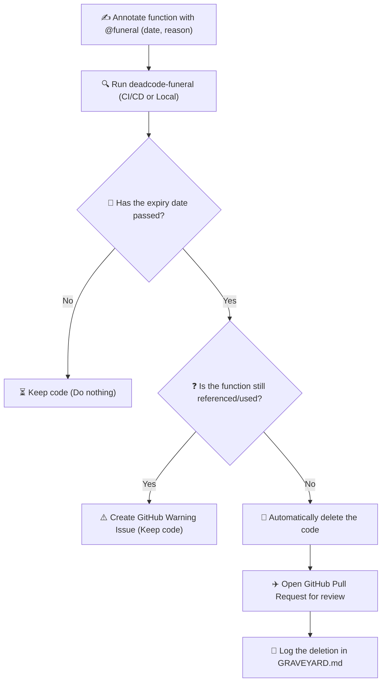

# DeadCode Funeral

<p align="center">
  
</p>

<p align="center">
  <a href="https://www.npmjs.com/package/deadcode-funeral"></a>
  <a href="https://github.com/Jasfer2xp/DeadCode-Funeral/actions"></a>
  <a href="https://github.com/Jasfer2xp/DeadCode-Funeral/blob/main/LICENSE"></a>
  <a href="https://img.shields.io/badge/PRs-welcome-brightgreen.svg?style=flat-square"></a>
</p>

Schedule your dead code for deletion. Automatically.

Overview
--------
DeadCode Funeral scans a repository for structured "burial" annotations (JSDoc/DocBlock `@funeral`, C# `[DeadCode(...)]`, PHP `#[DeadCode(...)]`, Python `@bury`, Go `// @funeral`, and Rust `// @funeral` or `#[dead_code_funeral]`) and can automatically open GitHub PRs to remove expired dead code after verifying it is unused. All deletions are logged to `GRAVEYARD.md`.




How it works
------------

### 1. Annotate your deprecating code
Add a structured `@funeral` block above functions you want to retire. You can specify an expiry date, reason, support ticket, and migration guide:

```typescript
// @funeral { "expiry": "2026-06-01", "reason": "Legacy auth provider, use OAuth2 instead." }
export function loginLegacy(user: string) {
  // ...
}
```

### 2. Run the scanner (CLI)
Scan the repository to find expired code:
```bash
deadcode-funeral scan --path .
```

*Output:*
```text
⚰️  DeadCode Funeral — Scanning project...
[EXPIRED] loginLegacy (expired 19 days ago)
Checking references...
No references found! Safe to bury.
```

### 3. Automatically Clean and Log
The tool deletes the expired code, opens a GitHub PR for team review, and logs it to `GRAVEYARD.md`:

```markdown
# Graveyard

- [x] Deleted `loginLegacy` (expired 2026-06-01) from `src/auth.ts` - Reason: Legacy auth provider, use OAuth2 instead.
```

---

Quick start
-----------
Install globally via npm to make the `deadcode-funeral` command available globally:

```bash
npm install -g deadcode-funeral
```

Or install as a development dependency inside your project:

```bash
npm install --save-dev deadcode-funeral
```

### Usage

Run a dry-run scan:

```bash
# If installed globally:
deadcode-funeral scan --path . --dry-run

# If installed locally:
npx deadcode-funeral scan --path . --dry-run
```

Preview creating PRs for expired items (dry-run):

```bash
npx deadcode-funeral open-pr --path . --dry-run
```

To actually open PRs and issues, provide a GitHub token with sufficient permissions (e.g., `repo` scope) and run:

```bash
export GITHUB_TOKEN=ghp_xxx
npx deadcode-funeral open-pr --path . --token $GITHUB_TOKEN --owner yourOrg --repo yourRepo
```

VS Code extension
-----------------
There's a minimal VS Code extension scaffold in `vscode-extension/`. Install dependencies, compile the extension, and load it into VS Code for a lightweight UX: status bar, hover hints, CodeLens to run scans, and a command to open PRs using a token stored in `deadcodeFuneral.githubToken` setting.

GitHub Action
-------------
Use the built-in action in `.github/workflows/deadcode-funeral.yml` or the local `action/` folder. The workflow installs deps, builds, and runs the action which will:

- Open warning issues for items expiring in N days (default 7)
- Open deletion PRs for expired and unused items

Testing
-------
Run the unit tests (Jest):

```bash
npm test
```

Notes & Safety
--------------
- The tool never silently deletes code — every deletion goes through a Pull Request.
- The PR creator checks that the working tree is clean before making commits and aborts if a change would remove more than 250 lines or a large portion of a file (>50%).
- **Python Indentation-Aware Scope Deletion**: Unlike brace-based languages, Python code removal is indentation-aware. The tool automatically detects the declaration's indentation and removes its entire block cleanly.
- **Improved Reference Checking**: The usage checker matches token word boundaries (`\bSymbolName\b`) rather than just function call syntax (`\bSymbolName\(`). This ensures that callbacks, imports, and references in routing files (e.g. Django urls or Laravel routes) are detected, preventing false deletions.
- **Automatic Ignored Paths**: Built-in ignores cover `node_modules`, `.git`, `bin`, `obj`, `dist`, and `out` directories by default to optimize scan times and prevent scanning built code.
- Tree-sitter is used where available for AST-accurate parsing; robust textual fallbacks are provided so the scanner works even without native parsers installed. Warnings about missing tree-sitter packages are limited to print only once per execution.

Optional: enabling AST-accurate removals (recommended)
----------------------------------------------------
For the safest automated removals, install optional tree-sitter native grammars on your machine or CI. The tool will fall back to heuristics if these are not present, but AST edits are more precise.

Examples:

```bash
# install optional native parsers (may require build tools)
npm install --no-save --no-audit tree-sitter tree-sitter-typescript tree-sitter-javascript tree-sitter-php tree-sitter-python
```

On Windows you may need the Visual Studio Build Tools installed. On Linux/macOS ensure you have a C++ toolchain available.

If you prefer not to install native parsers, the default heuristic removal remains safe due to dry-run and review via PRs.

Contributing
------------
Contributions welcome. Start by running tests, then open a PR with changes. See `CHANGELOG.md` for release notes.

Releasing
---------
This project includes convenience scripts to prepare releases. The `prepublishOnly` script runs the build before publish. To create a new patch release locally run:

```bash
npm run build
npm version patch -m "chore(release): %s"
# then push tags and publish when ready
git push --follow-tags
npm publish
```

Alternatively use the included `release` script which runs the build and bumps the patch version:

```bash
npm run release
```

Publishing requires that you have an npm account and the repository git history available locally. Releases are manual by default to avoid accidental publishing from CI.

